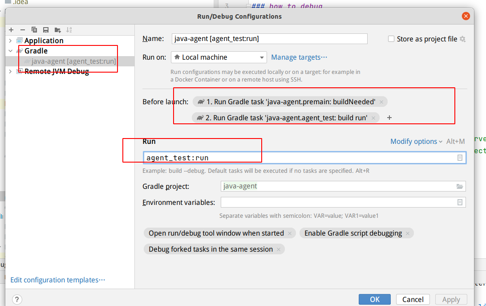

## java agent practice

### how to debug 
使用idea,
 agent_test:build.gradle
 ```
  
plugins {
    id 'application'
}
application {
    mainClassName = 'lh.test.Main'
    applicationDefaultJvmArgs = [
            "-javaagent:${project(':premain').projectDir}/build/libs/premain-1.0-SNAPSHOT.jar",
    ]
}

 ```
